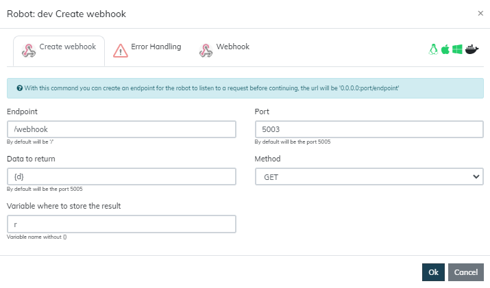

# Webhook
  
Con este módulo podrás trabajar con webhook en Rocketbot, como esperar una petición antes de continuar con el flujo de 
tu robot  
  

## Como instalar este módulo
  
__Descarga__ e __instala__ el contenido en la carpeta 'modules' en la ruta de rocketbot.  

## Como usar este módulo
Para usar este módulo, necesitas tener disponible el puerto que quieras usar como webhook.

### Exponer el webhook con NGROK (Opcional)
1. Descargar NGROK (https://ngrok.com/download)
2. Descomprimir el archivo
3. Ejecute 
ngrok y ejecute el comando "ngrok http port-number" Aquí el port-number es: 5002
Una vez que ejecute el comando anterior
 se expondrán dos URLs. Una para HTTP y otra para HTTPS. Puedes utilizar cualquiera de ellas.
4. Copie la URL pública 
del HTTP y del HTTP.

### Como usar el webhook

Al ejecutar el comando de 'Crear webhook', 
rocketbot se pausará esperando que se consulte la url configurada en el comando, ya sea con una petición GET o POST. Si 
la petición es GET, los datos a enviar deben estar en la URL. Si la petición es POST, los datos deben estar en el cuerpo
 de la petición.

Esto retornará una respuesta en JSON con el siguiente formato:

    {
        "status": True,
        "uuid": "2c9f8f7e-b8e7-4b5b-b8e7-4b5b8e7b8e7b"
    }

Para obtener datos desde Rocketbot, debes consultar la url 
'localhost:port/:enpoint/:uuid'.
Esto retornará una respuesta en JSON con el siguiente formato:

    {
        "status": True,
        "data": datos_desde_rocketbot
    }

## Descripción de los comandos

### Crear webhook
  
Con este comando puedes crear un webhook para que el robot escuche una petición antes de continuar, la url será 
'0.0.0.0:port/endpoint'
|Parámetros|Descripción|ejemplo|
| --- | --- | --- |
|Endpoint|Endpoint donde necesitas crear una petición, por defecto será '/'|/webhook|
|Puerto|Puerto donde necesitas crear un webhook, por defecto será '5005'|5005|
|Datos a devolver|Datos que quieres que devuelva al consultar la ruta url:puerto/endpoint/uuid. Este debe ser un objeto que contenga como clave el uuid obtenido al consultar el endpoint y el valor debe ser lo que deseas enviar. Ver ejemplo|{'255de1a0-a6ea-465e-aa6a-0d6b25dd81c6': ['data', 'data2']}|
|Método|Tipo de método para consultar el webhoook. Puede ser GET o POST|GET|
|Variable donde almacenar resultado|Nombre de la variable donde almacenar el resultado de la consulta. Ejemplo 'resultado'||
  

